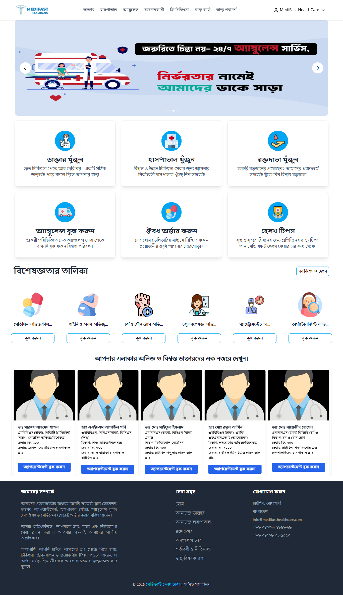
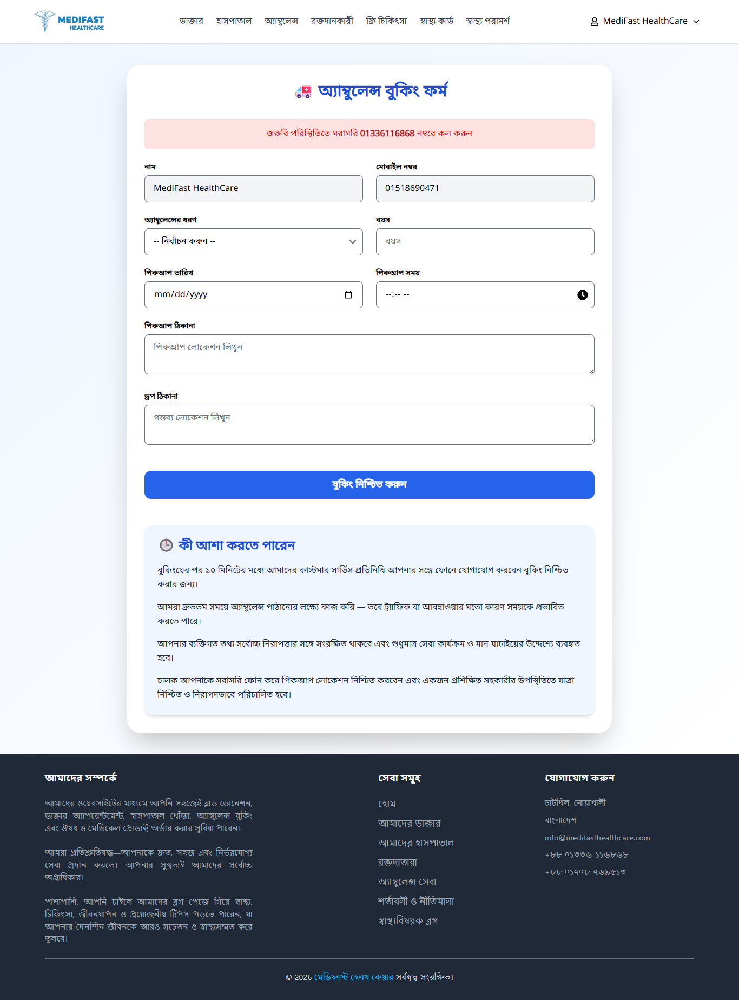
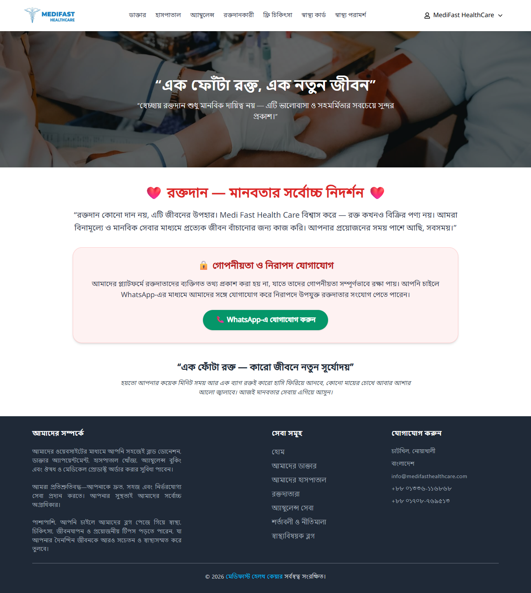
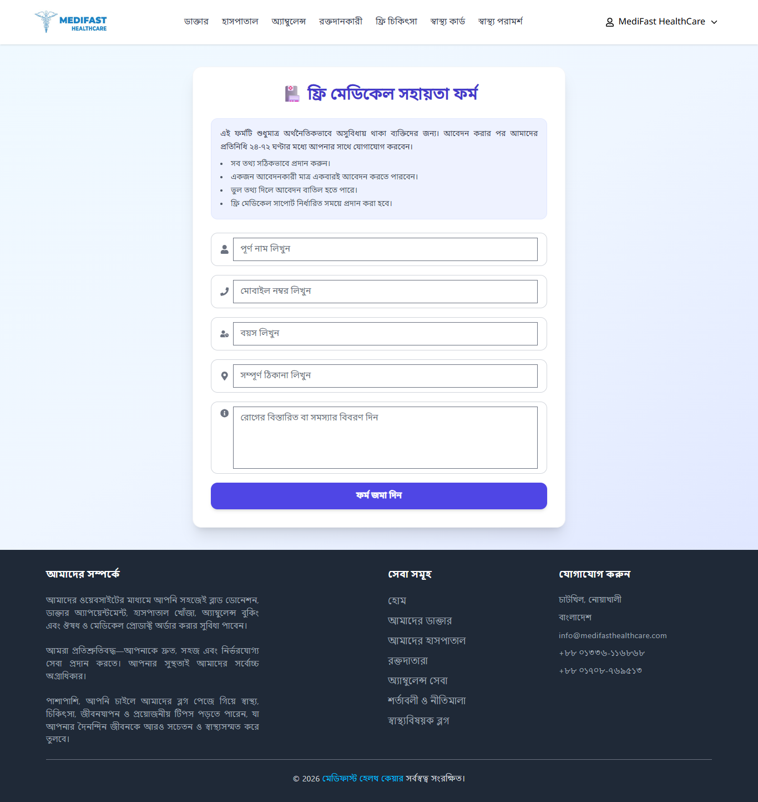
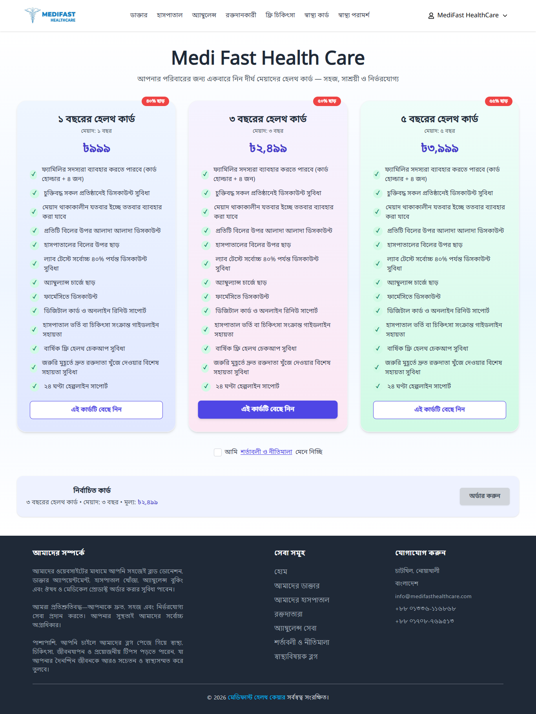

# 🏥 MediFast HealthCare  
### A Production-Ready MERN Stack Hospital Management System

A scalable and real-world **Hospital Management System** built with modern web technologies for managing patients, doctors, appointments, ambulance services, and digital healthcare operations in Bangladesh.

---

## 🌐 Live Demo

🚀 Official Website:  
[MediFast HealthCare](https://www.medifasthealthcare.com)  

🏥 Hospital Panel:  
[MediFast Hospital](https://panel.medifasthealthcare.com)  

---

## 🚀 Overview

**MediFast HealthCare** is a full-featured healthcare platform with **multi-role access system ( Hospital, Patient)** and a **Bangla-first UI experience**, designed for real hospital workflows.

---

## ✨ Key Features

### 👨‍⚕️ Hospital Doctor Management System
- Add / Update / Delete doctors  
- Specialization & category management  
- Experience & qualification tracking  
- Profile image upload system  
- Fully Bangla UI support  

### 🧑‍🤝‍🧑 Patient System
- Secure registration & login  
- Medical profile management  
- Appointment history tracking  

### 📅 Smart Appointment System
- Doctor availability-based scheduling  
- Dynamic booking system  
- Admin approval workflow  
- Bangla date & number support (০-৯)  

### 🚑 Ambulance Management
- Online ambulance booking system  
- ICU / AC / Non-AC / Normal / Deadbody ambulances  
- Driver & vehicle tracking system  
- Distance-based pricing logic  

### 🏥 Admin Dashboard
- Real-time analytics  
- Doctor & patient management  
- Appointment monitoring  
- Ambulance control panel  

### 🛒 Future-Ready Medicine System
- Online medicine listing  
- E-commerce integration ready  

---

## 🛠️ Tech Stack

### 🎨 Frontend
- React.js  
- Redux Toolkit  
- React Router  
- Tailwind CSS  
- Axios  

### ⚙️ Backend
- Node.js  
- Express.js  
- MongoDB  
- JWT Authentication  
- Redis Cache System  

### 📱 Mobile App (Optional)
- React Native  

---

## 🔐 Authentication System
- JWT-based secure authentication  
- Role-based access control (Hospital / Patient)  
- Protected API routes  
- Secure session handling  

---

## 🌐 Localization (Bangla First System)
- Full Bangla UI (বাংলা ইন্টারফেস)  
- Bangla number system (০-৯)  
- Bangla date formatting  
- Local user-friendly experience  

---

## ⚡ Performance Optimization
- Redis caching for API speed  
- Optimized Redux state management  
- Lazy loading implementation  
- Scalable backend architecture  

---

## 🖼️ UI Preview

---

## 📦 Project Modules
- Hospital Management System  
- Doctor Management System  
- Patient Management System  
- Appointment System  
- Ambulance Booking System  
- Admin Dashboard Analytics  
- Authentication System  

---

## 🧠 Future Improvements
- AI-based symptom checker 🤖  
- Video consultation system 📹  
- Payment gateway integration 💳  
- Online pharmacy & delivery system 💊  

---

## 🔐 Login Information (Demo)

> Admin / Hospital / Patient login is available via the hospital panel.

👉 Panel Access:  
[Hospital Management Panel](https://panel.medifasthealthcare.com)  

---

## 📌 Project Status

🚧 Production Ready (Core System Completed)  
⚡ Actively improving & scaling  

---

## ❤️ About This Project

**MediFast HealthCare** is built to digitize hospital management in Bangladesh with a focus on **speed, usability, and real-world healthcare workflow automation**.

---

## ⭐ Support

If you like this project, please give it a ⭐ on GitHub 🚀
